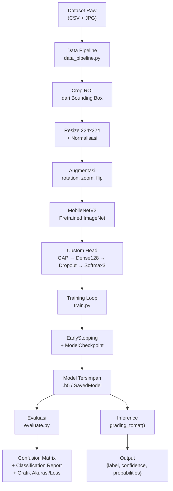
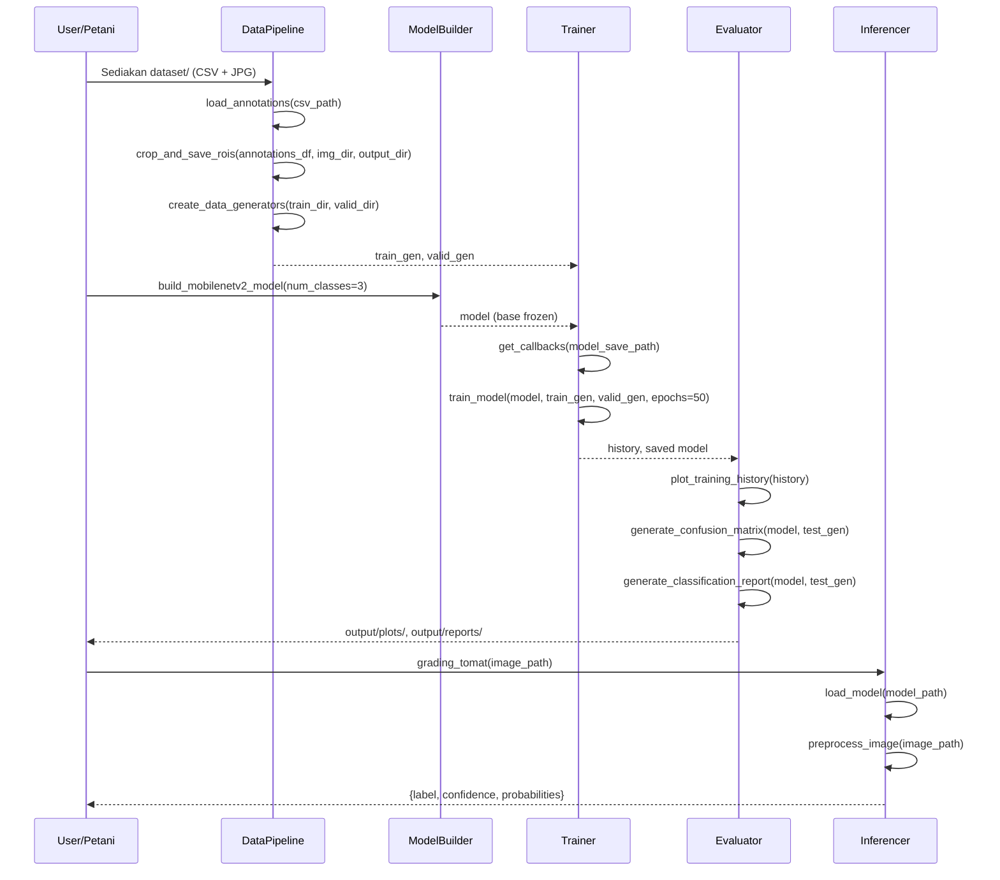

# Design Document: Sistem Klasifikasi Kematangan Tomat Berbasis Deep Learning (Transfer Learning MobileNetV2)

## Overview

Sistem ini mengimplementasikan klasifikasi kematangan tomat secara otomatis menggunakan Transfer Learning dengan arsitektur MobileNetV2 yang telah dilatih pada dataset ImageNet. Input berupa gambar tomat (JPG/PNG), dan output berupa label kematangan beserta tingkat kepercayaan prediksi. Sistem dirancang untuk mendukung otomasi grading kematangan tomat pada UMKM pertanian, menggantikan proses sortasi manual yang tidak konsisten dan memakan waktu.

Dataset yang digunakan berasal dari Roboflow (CC BY 4.0) dengan total 1.006 gambar dalam format object detection (bounding box). Sebelum digunakan untuk klasifikasi, setiap gambar perlu di-crop berdasarkan koordinat bounding box dari file `_annotations.csv` untuk mengekstrak Region of Interest (ROI) tomat.

Penelitian ini ditargetkan untuk publikasi jurnal Sinta 2/3 dalam konteks mata kuliah Kewirausahaan di STTR Informatika, dengan judul: *"Otomasi Grading Kematangan Tomat Berbasis Deep Learning untuk Efisiensi Operasional UMKM Pertanian"*.

---

## Arsitektur Sistem (High-Level)



---

## Alasan Pemilihan MobileNetV2 dari Perspektif Kewirausahaan UMKM

MobileNetV2 dipilih bukan hanya karena performa teknis, tetapi karena kesesuaiannya dengan konteks operasional UMKM pertanian:

| Kriteria | MobileNetV2 | VGG16/ResNet50 |
|---|---|---|
| Ukuran model | ~14 MB | ~500 MB / ~100 MB |
| Parameter | ~3.4 juta | ~138 juta / ~25 juta |
| Inferensi di CPU | ~50ms/gambar | >500ms/gambar |
| Bisa jalan di HP Android | Ya (TFLite) | Tidak praktis |
| Biaya deployment | Gratis (HP petani) | Butuh server cloud |
| Akurasi (ImageNet Top-1) | 71.8% | 71.3% / 76.1% |

**Justifikasi bisnis**: Petani UMKM tidak memiliki infrastruktur server. MobileNetV2 memungkinkan deployment langsung di smartphone Android melalui TensorFlow Lite, sehingga sistem grading dapat digunakan di lapangan tanpa koneksi internet. Ini secara langsung mengurangi biaya operasional dan meningkatkan efisiensi sortasi tomat sebelum distribusi ke pasar.

---

## Alur Data Detail (Sequence Diagram)



---

## Komponen dan Antarmuka

### Komponen 1: DataPipeline (`src/data_pipeline.py`)

**Tujuan**: Membaca anotasi CSV, melakukan crop ROI dari bounding box, dan menyiapkan generator data untuk training/validasi/testing.

**Antarmuka**:
```python
def load_annotations(csv_path: str) -> pd.DataFrame:
    """
    Membaca file anotasi CSV dari dataset Roboflow.
    
    Args:
        csv_path: Path ke file _annotations.csv
    Returns:
        DataFrame dengan kolom: filename, width, height, class, xmin, ymin, xmax, ymax
    """

def crop_and_save_rois(
    annotations_df: pd.DataFrame,
    img_dir: str,
    output_dir: str,
    target_size: tuple = (224, 224)
) -> None:
    """
    Crop ROI dari setiap gambar berdasarkan bounding box, resize, dan simpan.
    Struktur output: output_dir/{class_label}/{filename_crop}.jpg
    
    Args:
        annotations_df: DataFrame hasil load_annotations()
        img_dir: Direktori gambar sumber
        output_dir: Direktori output terstruktur per kelas
        target_size: Ukuran target resize (default 224x224 untuk MobileNetV2)
    """

def create_data_generators(
    train_dir: str,
    valid_dir: str,
    batch_size: int = 32
) -> tuple:
    """
    Membuat ImageDataGenerator dengan augmentasi untuk training dan validasi.
    
    Returns:
        (train_generator, valid_generator)
    """

def create_test_generator(
    test_dir: str,
    batch_size: int = 32
) -> ImageDataGenerator:
    """
    Membuat generator untuk test set (tanpa augmentasi, shuffle=False).
    """
```

**Tanggung Jawab**:
- Parsing CSV dengan format Roboflow (filename, width, height, class, xmin, ymin, xmax, ymax)
- Mapping class integer (0, 1, 2) ke label string ("Matang", "Setengah Matang", "Mentah")
- Crop dan resize ROI dengan padding jika bounding box terlalu kecil
- Augmentasi: rotation_range=20, zoom_range=0.2, horizontal_flip=True, brightness_range=[0.8,1.2]
- Normalisasi pixel ke range [0, 1] via `rescale=1./255`

---

### Komponen 2: ModelBuilder (`src/model.py`)

**Tujuan**: Membangun arsitektur Transfer Learning MobileNetV2 dengan custom classification head.

**Antarmuka**:
```python
def build_mobilenetv2_model(
    num_classes: int = 3,
    input_shape: tuple = (224, 224, 3),
    learning_rate: float = 0.001
) -> tf.keras.Model:
    """
    Membangun model MobileNetV2 dengan custom head untuk klasifikasi 3 kelas.
    Base layer MobileNetV2 di-freeze (trainable=False) pada tahap awal.
    
    Arsitektur custom head:
    MobileNetV2 (frozen) → GlobalAveragePooling2D → Dense(128, relu) 
    → Dropout(0.5) → Dense(3, softmax)
    
    Returns:
        Model Keras yang sudah dikompilasi dengan Adam optimizer
    """

def unfreeze_top_layers(
    model: tf.keras.Model,
    num_layers: int = 20
) -> tf.keras.Model:
    """
    Unfreeze N layer terakhir dari base MobileNetV2 untuk fine-tuning tahap 2.
    Learning rate dikurangi 10x untuk fine-tuning.
    
    Args:
        model: Model hasil build_mobilenetv2_model()
        num_layers: Jumlah layer dari akhir yang di-unfreeze (default 20)
    Returns:
        Model dengan layer terakhir trainable
    """
```

**Tanggung Jawab**:
- Load MobileNetV2 pretrained ImageNet tanpa top layer (`include_top=False`)
- Freeze semua layer base untuk transfer learning tahap 1
- Tambah custom head: GlobalAveragePooling2D → Dense(128, ReLU) → Dropout(0.5) → Dense(3, Softmax)
- Kompilasi dengan Adam(lr=0.001), loss='categorical_crossentropy', metrics=['accuracy']

---

### Komponen 3: Trainer (`src/train.py`)

**Tujuan**: Menjalankan training loop dengan callbacks untuk early stopping dan penyimpanan model terbaik.

**Antarmuka**:
```python
def get_callbacks(model_save_path: str) -> list:
    """
    Membuat list callbacks untuk training:
    - EarlyStopping: monitor='val_loss', patience=10, restore_best_weights=True
    - ModelCheckpoint: simpan model terbaik berdasarkan val_accuracy
    - ReduceLROnPlateau: kurangi LR jika val_loss stagnan
    
    Returns:
        List of Keras callbacks
    """

def train_model(
    model: tf.keras.Model,
    train_gen: ImageDataGenerator,
    valid_gen: ImageDataGenerator,
    epochs: int = 50
) -> History:
    """
    Menjalankan training loop utama (Transfer Learning tahap 1).
    
    Returns:
        Keras History object untuk plotting
    """

def fine_tune_model(
    model: tf.keras.Model,
    train_gen: ImageDataGenerator,
    valid_gen: ImageDataGenerator,
    epochs: int = 20
) -> History:
    """
    Fine-tuning opsional: unfreeze top layers dan lanjutkan training
    dengan learning rate lebih kecil (1e-5).
    
    Returns:
        Keras History object untuk fine-tuning phase
    """
```

---

### Komponen 4: Evaluator (`src/evaluate.py`)

**Tujuan**: Menghasilkan metrik evaluasi komprehensif untuk keperluan laporan jurnal.

**Antarmuka**:
```python
def plot_training_history(history: History, save_path: str) -> None:
    """
    Plot grafik akurasi dan loss (training vs validasi) dalam satu figure.
    Simpan ke save_path sebagai PNG.
    """

def generate_confusion_matrix(
    model: tf.keras.Model,
    test_gen: ImageDataGenerator,
    class_names: list,
    save_path: str
) -> None:
    """
    Generate dan visualisasi confusion matrix menggunakan seaborn heatmap.
    class_names: ["Matang", "Setengah Matang", "Mentah"]
    """

def generate_classification_report(
    model: tf.keras.Model,
    test_gen: ImageDataGenerator,
    class_names: list,
    save_path: str
) -> dict:
    """
    Generate classification report (Precision, Recall, F1-Score per kelas).
    Simpan sebagai file teks dan kembalikan sebagai dict.
    
    Returns:
        Dict dengan metrik per kelas dan rata-rata
    """

def evaluate_model(
    model: tf.keras.Model,
    test_gen: ImageDataGenerator,
    class_names: list,
    output_dir: str
) -> None:
    """
    Fungsi utama evaluasi: memanggil semua fungsi evaluasi di atas
    dan menyimpan semua output ke output_dir.
    """
```

---

### Komponen 5: Inferencer (`src/inference.py`)

**Tujuan**: Menyediakan fungsi prediksi single-image untuk deployment.

**Antarmuka**:
```python
def load_model(model_path: str) -> tf.keras.Model:
    """
    Load model dari file .h5 atau SavedModel directory.
    """

def preprocess_image(
    image_path: str,
    target_size: tuple = (224, 224)
) -> np.ndarray:
    """
    Preprocessing gambar untuk inferensi:
    1. Load gambar (RGB)
    2. Resize ke target_size
    3. Normalisasi ke [0, 1]
    4. Expand dims untuk batch dimension
    
    Returns:
        numpy array shape (1, 224, 224, 3)
    """

def grading_tomat(
    image_path: str,
    model_path: str = "output/models/best_model.h5"
) -> dict:
    """
    Fungsi utama grading kematangan tomat.
    
    Args:
        image_path: Path ke gambar tomat (JPG/PNG, ukuran bebas)
        model_path: Path ke model tersimpan
    
    Returns:
        {
            "label": "Matang" | "Setengah Matang" | "Mentah",
            "confidence": float (0.0 - 1.0),
            "probabilities": {
                "Matang": float,
                "Setengah Matang": float,
                "Mentah": float
            }
        }
    """
```

---

## Model Data

### Struktur Anotasi CSV (Input)

```python
# Format kolom dari Roboflow export
AnnotationRow = {
    "filename": str,   # Nama file gambar, contoh: "-1-_jpg.rf.abc123.jpg"
    "width": int,      # Lebar gambar asli dalam pixel
    "height": int,     # Tinggi gambar asli dalam pixel
    "class": int,      # 0=Matang, 1=Setengah Matang, 2=Mentah
    "xmin": int,       # Koordinat kiri bounding box
    "ymin": int,       # Koordinat atas bounding box
    "xmax": int,       # Koordinat kanan bounding box
    "ymax": int        # Koordinat bawah bounding box
}
```

### Mapping Kelas

```python
CLASS_MAPPING = {
    0: "Matang",           # Ripe - tomat merah penuh
    1: "Setengah Matang",  # Half-ripe - tomat oranye/merah muda
    2: "Mentah"            # Unripe - tomat hijau
}

# Untuk ImageDataGenerator (flow_from_directory), folder harus bernama:
# output/train/Matang/
# output/train/Setengah Matang/
# output/train/Mentah/
```

### Output Inferensi

```python
GradingResult = {
    "label": str,          # Label kelas prediksi
    "confidence": float,   # Probabilitas kelas prediksi (0.0 - 1.0)
    "probabilities": {     # Probabilitas semua kelas
        "Matang": float,
        "Setengah Matang": float,
        "Mentah": float
    }
}
```

### Statistik Dataset

```python
DatasetStats = {
    "total_images": 1006,
    "train": 705,    # ~70%
    "valid": 201,    # ~20%
    "test": 100,     # ~10%
    "format": "Object Detection (Bounding Box) → Crop untuk Klasifikasi",
    "input_size": (224, 224, 3),  # Setelah preprocessing
    "classes": 3
}
```

---

## Algoritma Utama (Low-Level Pseudocode)

### Algoritma 1: Crop ROI dari Bounding Box

```python
ALGORITHM crop_and_save_rois(annotations_df, img_dir, output_dir, target_size)
INPUT:
  - annotations_df: DataFrame dengan kolom [filename, class, xmin, ymin, xmax, ymax]
  - img_dir: direktori gambar sumber
  - output_dir: direktori output
  - target_size: (224, 224)
OUTPUT: File gambar tersimpan di output_dir/{class_label}/

PRECONDITIONS:
  - annotations_df tidak kosong
  - img_dir berisi file gambar yang sesuai dengan kolom filename
  - xmin < xmax, ymin < ymax untuk setiap baris

POSTCONDITIONS:
  - Setiap ROI tersimpan sebagai file JPG di subfolder kelas yang sesuai
  - Semua gambar output berukuran target_size
  - Tidak ada gambar sumber yang dimodifikasi

BEGIN
  UNTUK setiap baris row DALAM annotations_df:
    img_path ← os.path.join(img_dir, row.filename)
    
    JIKA img_path tidak ada MAKA
      LOG warning "Gambar tidak ditemukan: {img_path}"
      LANJUT ke baris berikutnya
    AKHIR JIKA
    
    img ← PIL.Image.open(img_path).convert("RGB")
    
    # Crop ROI berdasarkan bounding box
    roi ← img.crop((row.xmin, row.ymin, row.xmax, row.ymax))
    
    # Validasi ukuran ROI (minimal 10x10 pixel)
    JIKA roi.width < 10 ATAU roi.height < 10 MAKA
      LOG warning "ROI terlalu kecil, skip: {row.filename}"
      LANJUT ke baris berikutnya
    AKHIR JIKA
    
    # Resize ke target_size
    roi_resized ← roi.resize(target_size, PIL.Image.LANCZOS)
    
    # Tentukan folder output berdasarkan kelas
    class_label ← CLASS_MAPPING[row.class]
    save_dir ← os.path.join(output_dir, class_label)
    os.makedirs(save_dir, exist_ok=True)
    
    # Simpan dengan nama unik
    save_name ← f"{row.filename.replace('.jpg', '')}_{row.class}.jpg"
    roi_resized.save(os.path.join(save_dir, save_name))
  AKHIR UNTUK
END

LOOP INVARIANT: Setiap iterasi, semua ROI yang telah diproses tersimpan dengan benar
  dan struktur direktori output tetap konsisten.
```

### Algoritma 2: Membangun Model MobileNetV2

```python
ALGORITHM build_mobilenetv2_model(num_classes, input_shape, learning_rate)
INPUT:
  - num_classes: 3
  - input_shape: (224, 224, 3)
  - learning_rate: 0.001
OUTPUT: tf.keras.Model yang sudah dikompilasi

PRECONDITIONS:
  - num_classes >= 2
  - input_shape == (224, 224, 3) untuk kompatibilitas MobileNetV2
  - learning_rate > 0

POSTCONDITIONS:
  - Model memiliki layer output dengan num_classes neuron + softmax
  - Base MobileNetV2 trainable=False (frozen)
  - Model sudah dikompilasi dan siap training

BEGIN
  # Load pretrained MobileNetV2 tanpa top layer
  base_model ← MobileNetV2(
    input_shape=input_shape,
    include_top=False,
    weights="imagenet"
  )
  
  # Freeze semua layer base (Transfer Learning tahap 1)
  base_model.trainable ← False
  
  # Bangun custom classification head
  x ← base_model.output
  x ← GlobalAveragePooling2D()(x)
  x ← Dense(128, activation="relu")(x)
  x ← Dropout(0.5)(x)
  output ← Dense(num_classes, activation="softmax")(x)
  
  # Buat model final
  model ← tf.keras.Model(inputs=base_model.input, outputs=output)
  
  # Kompilasi model
  model.compile(
    optimizer=Adam(learning_rate=learning_rate),
    loss="categorical_crossentropy",
    metrics=["accuracy"]
  )
  
  RETURN model
END
```

### Algoritma 3: Fungsi grading_tomat (Inferensi)

```python
ALGORITHM grading_tomat(image_path, model_path)
INPUT:
  - image_path: str (path ke gambar JPG/PNG)
  - model_path: str (path ke model .h5)
OUTPUT: dict {label, confidence, probabilities}

PRECONDITIONS:
  - image_path menunjuk ke file gambar yang valid (JPG/PNG)
  - model_path menunjuk ke file model yang valid
  - File gambar dapat dibuka oleh PIL

POSTCONDITIONS:
  - label ∈ {"Matang", "Setengah Matang", "Mentah"}
  - 0.0 ≤ confidence ≤ 1.0
  - sum(probabilities.values()) ≈ 1.0 (±1e-5)
  - Tidak ada side effect pada file input

BEGIN
  # Load model (dengan caching untuk efisiensi)
  model ← load_model(model_path)
  
  # Preprocessing gambar
  img_array ← preprocess_image(image_path, target_size=(224, 224))
  # img_array.shape == (1, 224, 224, 3)
  
  # Prediksi
  predictions ← model.predict(img_array)
  # predictions.shape == (1, 3)
  
  # Ambil probabilitas per kelas
  probs ← predictions[0]  # shape (3,)
  
  # Tentukan kelas prediksi
  predicted_idx ← argmax(probs)
  predicted_label ← CLASS_NAMES[predicted_idx]
  confidence ← float(probs[predicted_idx])
  
  # Susun output
  result ← {
    "label": predicted_label,
    "confidence": confidence,
    "probabilities": {
      "Matang": float(probs[0]),
      "Setengah Matang": float(probs[1]),
      "Mentah": float(probs[2])
    }
  }
  
  RETURN result
END

POSTCONDITION VERIFICATION:
  ASSERT result["label"] IN ["Matang", "Setengah Matang", "Mentah"]
  ASSERT 0.0 <= result["confidence"] <= 1.0
  ASSERT abs(sum(result["probabilities"].values()) - 1.0) < 1e-5
```

---

## Struktur File Proyek

```
tomato-ripeness-classifier/
├── dataset/
│   ├── train/          # 705 gambar + _annotations.csv
│   ├── valid/          # 201 gambar + _annotations.csv
│   └── test/           # 100 gambar + _annotations.csv
├── src/
│   ├── data_pipeline.py    # Preprocessing + augmentasi
│   ├── model.py            # Arsitektur MobileNetV2
│   ├── train.py            # Training loop + callbacks
│   ├── evaluate.py         # Evaluasi + visualisasi
│   ├── inference.py        # Fungsi grading_tomat()
│   └── utils.py            # Helper functions
├── output/
│   ├── models/             # Saved model (.h5 / SavedModel)
│   ├── plots/              # Grafik akurasi/loss, confusion matrix
│   └── reports/            # Classification report (.txt)
├── main.py                 # Entry point full pipeline
└── requirements.txt        # Dependensi Python
```

---

## Penanganan Error

### Skenario 1: Gambar Tidak Ditemukan

**Kondisi**: File gambar yang tercantum di CSV tidak ada di direktori  
**Respons**: Log warning, skip gambar tersebut, lanjutkan proses  
**Pemulihan**: Proses tetap berjalan dengan gambar yang tersedia

### Skenario 2: ROI Terlalu Kecil

**Kondisi**: Bounding box menghasilkan crop < 10x10 pixel  
**Respons**: Log warning dengan nama file, skip gambar  
**Pemulihan**: Gambar di-skip, tidak mempengaruhi gambar lain

### Skenario 3: Model Tidak Ditemukan saat Inferensi

**Kondisi**: `model_path` tidak valid atau file tidak ada  
**Respons**: Raise `FileNotFoundError` dengan pesan deskriptif  
**Pemulihan**: User perlu menjalankan training terlebih dahulu

### Skenario 4: Format Gambar Tidak Didukung

**Kondisi**: File bukan JPG/PNG atau corrupt  
**Respons**: Raise `ValueError` dengan pesan yang jelas  
**Pemulihan**: User perlu menyediakan gambar yang valid

### Skenario 5: Training Diverge (Loss = NaN)

**Kondisi**: Loss menjadi NaN selama training  
**Respons**: EarlyStopping akan menghentikan training  
**Pemulihan**: Kurangi learning rate, periksa data preprocessing

---

## Strategi Testing

### Unit Testing

- `test_load_annotations`: Verifikasi parsing CSV menghasilkan DataFrame dengan kolom yang benar
- `test_crop_roi`: Verifikasi output crop berukuran 224x224
- `test_build_model`: Verifikasi arsitektur model (jumlah layer, output shape)
- `test_preprocess_image`: Verifikasi output shape (1, 224, 224, 3) dan range [0, 1]
- `test_grading_tomat_output_format`: Verifikasi struktur dict output

### Property-Based Testing (Hypothesis)

**Library**: `hypothesis` + `hypothesis[numpy]`

1. **Output Validity**: Untuk sembarang gambar valid, `grading_tomat()` selalu mengembalikan label dari set {"Matang", "Setengah Matang", "Mentah"}

2. **Confidence Range**: Untuk sembarang gambar valid, `0.0 ≤ confidence ≤ 1.0`

3. **Probability Sum**: Untuk sembarang gambar valid, `|sum(probabilities) - 1.0| < 1e-5`

4. **Input Robustness**: Untuk sembarang gambar JPG/PNG dengan ukuran (H, W) dimana H,W ∈ [10, 4000], fungsi tidak crash

5. **Preprocessing Determinism**: Untuk gambar yang sama, `preprocess_image()` selalu menghasilkan tensor identik

6. **Class Balance Awareness**: Augmentasi tidak mengubah distribusi label (jumlah sampel per kelas tetap sama setelah augmentasi)

7. **Model Accuracy Threshold**: Akurasi pada test set ≥ 80% (threshold riset Sinta 2/3)

### Integration Testing

- `test_full_pipeline`: Jalankan pipeline lengkap dari CSV → crop → training (2 epoch) → evaluasi → inferensi
- `test_data_generator_output`: Verifikasi batch shape dari generator sesuai (batch_size, 224, 224, 3)

---

## Pertimbangan Performa

- **Batch Size**: 32 (optimal untuk GPU Colab T4, dapat dikurangi ke 16 untuk RAM terbatas)
- **Epochs**: Maksimal 50 dengan EarlyStopping (patience=10), rata-rata berhenti di ~20-30 epoch
- **Waktu Training**: ~5-10 menit di Google Colab GPU untuk dataset 705 gambar
- **Inferensi**: ~50ms per gambar di CPU, ~5ms di GPU
- **Memory**: Model ~14MB, dataset crop ~50MB (estimasi)
- **Caching**: Model di-cache setelah load pertama untuk efisiensi inferensi berulang

---

## Pertimbangan Keamanan

- Dataset berlisensi CC BY 4.0 — wajib mencantumkan atribusi Roboflow dalam publikasi
- Model tidak menyimpan data gambar pengguna
- Tidak ada transmisi data ke server eksternal (fully offline)
- Validasi input gambar sebelum preprocessing untuk mencegah crash

---

## Dependensi

```
tensorflow>=2.10.0
numpy>=1.21.0
pandas>=1.3.0
Pillow>=9.0.0
matplotlib>=3.5.0
seaborn>=0.11.0
scikit-learn>=1.0.0
hypothesis>=6.0.0  # untuk property-based testing
```
